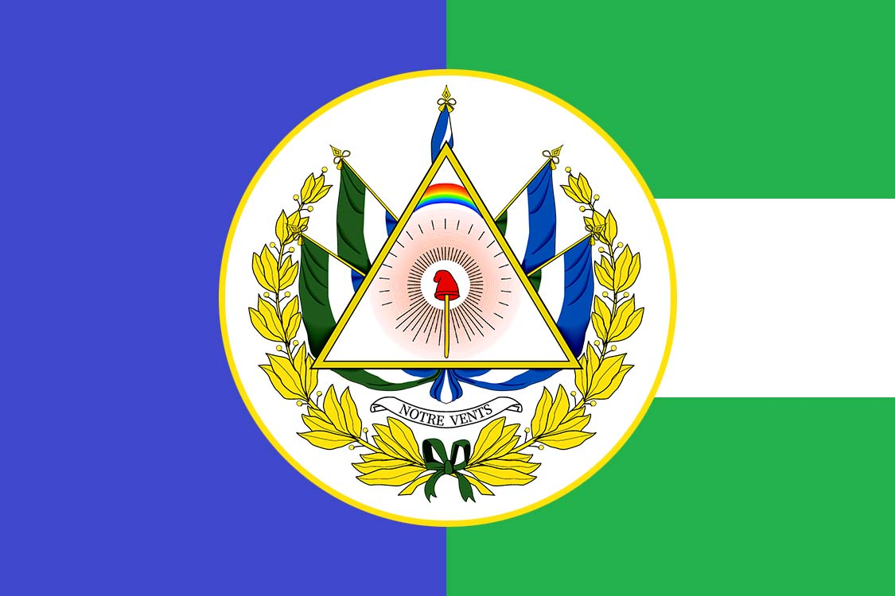
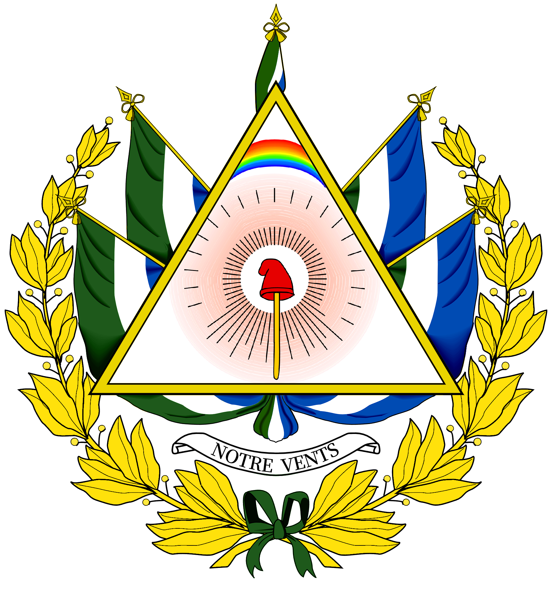

# 千风之国

千风之国是服友买买提的MC架空国家，其原型为18世纪的法国。千风之国是服务器内设定年代最古老，科技最落后的架空国家，所以在和其他服友互动设定的时候会出现很多难绷的情况。

## 概况

千风之国，其法语和千风语名称为Ventiade，意为风之诗。其通行的语言为法语，另有一门基于此的人造语言即千风语(Langue Ventiade)，作为富有声望然而不常用的「革命语言」。千风之国的政体为共和制，废奴，由国民公会领导。

千风之国无交通法规，而是凭借习惯，习惯向右让行。如无需让行，则马车在中间行驶，周围则留给行人。

千风之国的道路分为Rue和Avenue，即「路」和「大道」，大道两排有成荫的树木，且间隔设有星形广场和喷泉——路则仅有少量行道树或无行道树。

千风之国的政府驻地在千风之城国家宫，杜乐丽花园是千风之国最大的公园，第二大的公园则是平等宫花园。目前千风之城最繁华的地段在平等宫花园周围的好孩子街、法律街和小尚街。

千风人大多居住在公寓楼内，按照买买提GDP划分方法为小公寓。仅有极少数人居住于公馆。千风之城全部公馆均非私有，而是归属文物保护单位、其他政府单位或作为外国使馆。

千风之国采用共和历，用自然现象为每月每日命名，共和历的一年分为12个月，即葡月、雾月、霜月、雪月、雨月、风月、芽月、花月、牧月、获月、热月、果月，每月3旬，每旬10日，每旬3休，每日从子夜至子夜，计10小时，每小时100分钟，每分钟100秒。一年365日，四年一闰，则每年有5~6日不属于任何一月，为「美德日」、「天才日」、「劳动日」、「舆论日」、「奖励日」，闰日为「革命日」。

千风之国全民皆兵，居民普遍持有燧发枪，战时普遍使用燧发枪和前膛炮，排枪+散兵作战，使用炮兵集群。千风之国取暖靠木柴和火炉，或用木炭，只有那些神秘的外国人才会用煤。

（受限于科技水平和生产力，允许持枪还是不会造成什么社会问题的。决斗！Duel！）

千风之国是高度发达的手工业出口国，具有全大陆规模最大和最发达的近代化市场经济。目前，国内所有粮食消费依赖其与姊妹共和国的长期进口协定。通过出于意识形态的国内农产品限价法令（*<mark>在限价法令上建立断头台！愤怒的人民不再需要十万颗人头，而是二十万，三十万，一百万颗人头！——埃贝尔</mark>*），千风之国保持强劲的贸易顺差。（*<mark>姊妹共和国：那我呢？</mark>*）

千风之国是羊油蛋联盟的创始成员国。

## 维度观念

千风之国在革命战争中征服了敌人，在当地按照千风之国的体制建立了一系列姊妹共和国，整合了世界（L'Univers）的市场。千风的人民由此得到了世界的精神，故而可以上升到众国（Tout l'états）的维度。于是，千风的人民，虽然与世界维度当中他国的人平等，但却有着更高的视野，可以与众国的人民交流。千风之国，作为众国这个新维度当中的一国，自然也可以与众国的众国建立外交关系。千风的人民知道，众国维度当中最大的大陆，是在企鹅（Quié）的名下，名下的列国由各自的君长和人民自治。于是，千风之国国民公会，本着扫平丑类（<mark>*伏尔泰：Écrasez l’infâme!* </mark>），粉碎暴君的原则，对企鹅大陆的众国宣战！（这里是2022年的设定）

好在，宣战是基于原则，千风市长设立了比较现实的方案。千风之国颁布花月法令，允许众国维度当中企鹅大陆的众国，在与千风之国交战的同时，来到千风之城设立大使馆，并以此开展两国在交战之下的友好交流。（原帖还有一句：千风之国向众国伸出橄榄枝，想要建交的国家请在本贴留言#(滑稽)）（这里也是2022年的设定）

千风之国认识到两个维度：即「世界」和「众国」。千风之国可以控制「世界」的精神，故而能以绝对精神为介质，输送名为「思想」的幻象。凭着这层幻想，千风之国可以与「众国」交涉，在服务器中活动。其实在这两个维度之上，还有一个更高的维度，即「真理」，这个维度中和千风之国对应的国家叫做法兰西。（这里也是2022年的设定）

## 历史

如若上升到「真理」维度，千风之国建立于2022年5月21日。每年的这个时候，即便是不知道千风之国的人，也会上街庆祝。

千风之国曾是强大的专制王国，名曰富埃王国(贵族口音)/富瓦王国(平民口音)，因财政问题爆发革命，致使昔日国王被送上断头台。平民建立共和国，辄与全大陆的国家交战，征服了一切反革命势力。革命大获全胜之后，共和国更改其国号为千风之国，去除了封建制影响。

千年以前，千风人建立过一个更为庞大的帝国：迦剌提亚。其首都迦利亚城遭遇雪灾之后，千风人才迁徙到如今的领土。

## 版图

千风之国目前的疆域为：千风之城、马提尼克省，千风之城下辖狄马松（石匠区），樱园山（山岳区），阿耳卡狄雅（平原区）。马提尼克省为海外省，国旗蓝底白十字贯穿，政府驻地为滨菊镇。

## 外交

目前千风之国的建交国家有：浆果教会、延华革命联盟共和国、苏维埃大明共和国、塔格塔联邦、大蓝帝国、末联。后两者不常上服务器，故而尚未选定大使馆，其余邦交国家分别驻扎在千风之城的日光灯馆、阿让松府、朗布耶府、拉罗什居永馆。

## 你知道吗

千风之国的名称Ventiade参考了法国大革命时期巴黎圣母院的名字「法兰西亚德」，后者——意为法兰西之诗——同样参考了荷马的诗歌《伊利亚德》，即伊利翁（特洛伊）之诗。

千风之国的政体和全民皆兵的体制参照了1794年的《共和三年宪法》。

千风之国似乎高雅过度以至于在革命国家中毫无存在感。。。

千风之国的路政参照了波旁王朝的法国。

为避免服务器卡顿吞实体的问题，千风之城的一切生物信息（村民命名牌）存储在平等宫柱廊顶部的箱子里。

为了避免社会恐慌，苏明和革联人会把自己的使馆用小发电机藏起来。

苏明在千风之城开有杨氏关东正宗戗面馒头铺，还有蒸饺铺，革联则开有南兴大排档。JOJA公司在千风之城开有百货商场。

虽然千风之国没有禁毒法令，但千风之城的居民对浆果教会带来的浆果仍然敬而远之，仅仅拥抱那份友好。

类似的，苏明人有时候会带来几团刘德凯，散发着危险的气质。

## 国旗&国徽

正式国旗

民用旗

国徽
